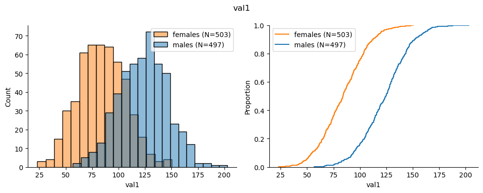
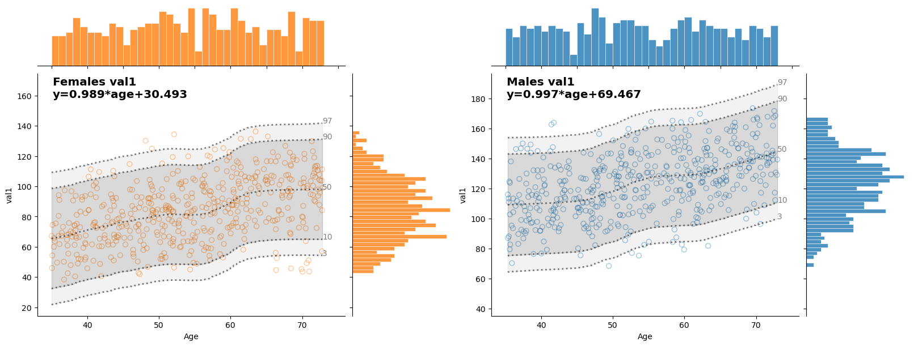

# pheno-utils

<!-- WARNING: THIS FILE WAS AUTOGENERATED! DO NOT EDIT! -->

pheno-utils is a dynamic Python package developed by Pheno.AI, for
handling our medical datasets. It simplifies data loading, enables
effective merging, and offers intuitive visualization tools.

## Install

``` sh
pip install pheno_utils
```

## How to use

Examples:

``` python
data = generate_synthetic_data(n=1000)
hist_ecdf_plots(data=data, col="val1")
```



``` python
age_refplots = GenderAgeRefPlot(data, "val1")
age_refplots.plot()
```



## Setting Up pheno-utils

To use `pheno-utils`, you must have a `config.json` file. This file
should be set up according to your filesystem and placed in the
`~/.pheno/` directory.

### If You’re Working on TRE

For those working in the Trusted Research Environment (TRE), you don’t
need to worry about the `config.json` file. It will be automatically
generated for you!

### If You’re Working with Phenos’ S3 Bucket

If you’re working with Phenos’ S3 bucket, you’ll need to manually create
the `config.json` file. You can do this by running the following Python
script:

``` sh
python config_setup/create_default_config.py -d s3://datasets_bucket_name
```

### If you are working on local file system

If you are working on local file system, you’ll need to manually create
the `config.json` file and locating it under `~/.pheno/` directory.
Please use the config_setup/example_config.json as a template for your
config.json file.
